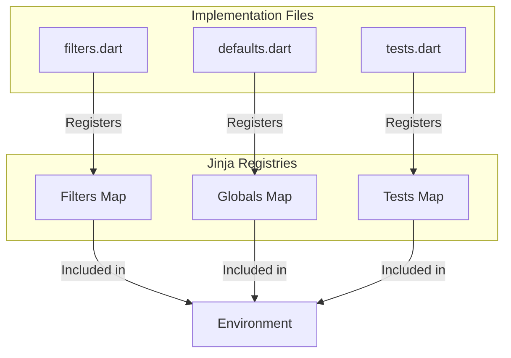

# Add comprehensive globals, filters, and tests to jinja.dart

I will implement a massive expansion of the library's built-in capabilities, incorporating core Jinja2 features and high-utility custom extensions from major frameworks.

### 1. Expanded Filter Suite (`lib/src/filters.dart`)

I will add the following filters, grouped by functionality:

**Text Processing & Safety:**

- `urlencode`: URI component encoding for strings and maps.
- `xmlattr`: Converts a map to XML attribute string.
- `urlize`: Automatic linkification of URLs in text.
- `indent`: Prefixes lines with a specified number of spaces.
- `slugify`: Generates URL-friendly lowercase hyphens-separated strings.
- `quote`: Wraps strings in safe quotes.
- `strftime` / `dateformat`: Date formatting using `package:intl`.

**Collection & Data Manipulation:**

- `sort`: Full sorting support with `attribute`, `reverse`, and `case_sensitive`.
- `unique`: Deduplication for lists and iterables.
- `min` / `max`: Finds extremum values, supporting `attribute` lookup.
- `groupby`: Advanced grouping using `package:collection`.
- `intersect` / `difference`: Set operations for lists.
- `pluck`: Alias for `map(attribute=...)` to pull attributes from lists of maps/objects.
- `shuffle`: Randomizes the order of a collection.
- `combine`: Merges two maps into one.

**Functional & Selection:**

- `select` / `reject`: Filters sequence based on a test.
- `selectattr` / `rejectattr`: Filters sequence of objects based on a test applied to an attribute.
- `map`: Enhanced to support attribute/item lookup directly.

**Math & Coercion:**

- `round` / `round_to_even`: Numerical rounding with precision and parity options.
- `increment`: Simple filter to add 1 to a number.
- `abs`: (Already exists, will verify completion).
- `bool` / `int` / `float`: Explicit type coercion filters.

**Data Serialization & Introspection:**

- `fromjson` / `fromyaml`: Deserializes JSON (and potentially YAML) strings.
- `pprint`: Pretty-prints objects for debugging.
- `base64encode` / `base64decode`: Utilities for Base64 transformations.
- `runtimetype`: (Already exists, will verify).

**Regex Support:**

- `regex_replace`, `regex_search`, `regex_findall`: Full regex suite for complex string manipulation.

### 2. Powerful Globals (`lib/src/defaults.dart`)

I will add these global functions and utility classes:

- `dict`: Helper to create Maps from named arguments.
- `cycler`: Utility class to rotate through values (e.g., alternating row colors).
- `joiner`: Utility class for conditional separators.
- `lipsum`: Placeholder text generator with `n`, `html`, `min`, `max` support.
- `zip`: Joins multiple iterables element-wise (using `package:collection`).
- `now`: Global for current time, supporting optional formatting.
- `ENV`: Safely fetches environment variables (using `Platform.environment` if available, or returning null/default).
- `context_info`: Debugging helper that exposes current context variables and blocks.

### 3. Logical & Type Tests (`lib/src/tests.dart`)

I will expand the test registry with:

- `subsetof` / `supersetof`: Relationship checks between collections.
- `match` / `search`: Regex-based string testing.
- `version`: Version comparison test (e.g., `{{ '1.2.3' is version('>=1.0.0') }}`).
- `callable`, `iterable`, `mapping`, etc.: (Existing, will ensure completion).

### 4. Implementation Strategy & Validation

- **Standardization:** All filters will use the `doName` prefix, and tests will use `isName`.
- **Error Handling:** Use `UndefinedError` and `TemplateRuntimeError` consistently.
- **Dependencies:** Leverage `package:collection`, `package:intl`, and `package:uuid` which are already in `pubspec.yaml`.
- **Testing:** Add a new comprehensive test file `test/builtins_test.dart` to verify all new additions.

## Mermaid Visualization of Registry Structure

