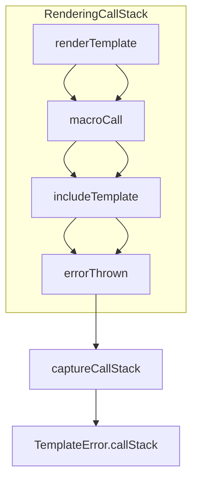

# Rendering Call Stack Implementation

## Goals

- Implement a **real rendering call stack** (template → macro → include chain) tracked during rendering.
- Wire this call stack into **enhanced exceptions** so `TemplateError.callStack` is populated and rendered in error messages.
- Keep the implementation **backward compatible** and low-overhead for normal rendering.

## High-Level Design

- Represent the rendering call stack as an **ordered list of frames**, each describing where we are in template rendering (template path, line, and operation such as macro or include).
- Use a **Zone-local stack** so both sync and async rendering share the same call stack per render invocation without global mutable state.
- Provide a single public utility `captureCallStack({int maxDepth = 10})` in `[lib/src/utils.dart](lib/src/utils.dart)` that reads the current rendering call stack, formats it into human-readable strings, and truncates to `maxDepth` (default 10).
- Optionally fall back to a **trimmed Dart stack trace** when no rendering call stack is available (e.g., when `captureCallStack` is invoked outside rendering), so tests and non-render contexts still get useful information.

### Call Stack Representation

- Add an internal private frame model in `utils.dart`, for example `_RenderFrame` with:
  - `String? templatePath` (e.g., `"users/profile.html"` or `"<string>"`)
  - `int? line` (line number of the call site when available)
  - `String description` (e.g., `"template root"`, `"macro renderUser"`, `"include sidebar.html"`)
- Store frames in a Zone-local list:
  - Define a private zone key (e.g., `_callStackZoneKey = Object()`).
  - Current stack accessor reads `Zone.current[_callStackZoneKey]` as `List<_RenderFrame>?`.

### Call Stack Management Helpers

- In `utils.dart`, add **internal helper functions** to manage frames:
  - `List<_RenderFrame> _getCurrentFrames()` – returns the current list or an empty list if none is set.
  - `T _withRenderFrame<T>(_RenderFrame frame, T Function() body)` – creates a new list `[...]` appending `frame` to the current list and runs `body` in a `runZoned` with `zoneValues` set to that updated list.
  - `Future<T> _withRenderFrameAsync<T>(_RenderFrame frame, Future<T> Function() body)` – async variant returning a `Future<T>` and using `runZoned` around the async body, so nested `await`s see the updated stack.
- **Ordering**: frames are stored **root → leaf** so `captureCallStack` can simply iterate from index 0.

### captureCallStack Implementation

- Implement `captureCallStack({int maxDepth = 10})` in `[lib/src/utils.dart](lib/src/utils.dart)` as:
  - If `maxDepth <= 0`, return an empty list.
  - Read the Zone-local frames; if non-empty:
    - Map each `_RenderFrame` to a human string, e.g. `"${templatePath ?? '<unknown>'}${line != null ? ':$line' : ''} ($description)"`.
    - Truncate to `maxDepth` and return as `List<String>`.
  - If the Zone-local frames are empty or not initialized, **fallback** to `StackTrace.current`:
    - Split by newline, trim, filter non-empty frames.
    - Take up to `maxDepth` lines and return them as `List<String>`.
- This keeps behavior **useful in tests** that call `captureCallStack` outside rendering, while rendering errors will prefer the richer render-specific frames.

## Integration Points in Core Code

### 1) Template Entry Points (Environment / Template)

- In `[lib/src/environment.dart](lib/src/environment.dart)` `Template` methods:
  - `String render([Map<String, Object?>? data])`:
    - Wrap the inner logic creating `StringBuffer` and calling `renderTo` inside `_withRenderFrame` with a root frame like:
      - `templatePath`: `path ?? '<string>'`
      - `line`: `null`
      - `description`: `"template root"`
  - `void renderTo(StringSink sink, [Map<String, Object?>? data])`:
    - Keep current logic, but ensure it is always executed **inside** the root frame (by wrapping in `render` or directly here); avoid double-wrapping.
  - `Future<String> renderAsync([Map<String, Object?>? data])` and `Future<void> renderToAsync(...)`:
    - Use `_withRenderFrameAsync` to wrap the async rendering with a root frame constructed similarly.
    - Example shape:
      - `return _withRenderFrameAsync(rootFrame, () async { ... await renderToAsync(...); return buffer.toString(); });`

### 2) Macro Calls in Renderer

- In `[lib/src/renderer.dart](lib/src/renderer.dart)` `StringSinkRenderer.getMacroFunction`:
  - Inside the inner `macro(...)` function, when executing the macro body (`node.body.accept(this, derived);`):
    - Wrap this call in `_withRenderFrame` so macro invocations show up as frames:
      - `templatePath`: `derived.template ?? context.template ?? template.path ?? '<unknown>'`
      - `line`: `node.line` when available.
      - `description`: `"macro ${node.name}"`.
  - For async macro output (when `buffer is _AsyncCollectingSink`):
    - Ensure that the `Future` created by `buffer.getResolvedContent()` is executed under the same macro frame, by using `_withRenderFrameAsync` if needed.

### 3) Includes (visitInclude)

- In `[lib/src/renderer.dart](lib/src/renderer.dart)` `visitInclude(Include node, StringSinkRenderContext context)`:
  - After resolving `template`, when `template != null`:
    - Derive a context with the included template info:
      - `context = context.derived(withContext: node.withContext)` (as today) but also **set** its `template` and `source` from the `Template` instance (`template.path` and `template.source`) if not already done.
    - Wrap `template.body.accept(this, context);` in `_withRenderFrame` with:
      - `templatePath`: `template.path ?? context.template ?? '<unknown>'`
      - `line`: `node.line`
      - `description`: `"include"` (or `"include ${template.path}"` for clarity).
- In async renderer (`visitInclude` in `AsyncRenderer`), reuse the same base renderer logic so the call stack frames are correctly captured during async includes.

### 4) Other Potential Frames (Optional, Future-Friendly)

- Consider additional frame types in the renderer/runtime for better fidelity (can be phased in):
  - **Block renders** (e.g., `visitBlock`) – frame description `"block ${block.name}"`.
  - **Imported templates** or `from ... import` constructs.
  - **Async filter resolution** or async globals where a template switch occurs.
- The plan focuses first on **templates, macros, and includes**, which already covers the main call chain described in the README.

## Wiring Call Stack into Exceptions

### 5) TemplateErrorWrapper Call Sites

- In `[lib/src/exceptions.dart](lib/src/exceptions.dart)`, `TemplateErrorWrapper` already accepts an optional `List<String>? callStack` and falls back to the original error’s `callStack` when null.
- At all `TemplateErrorWrapper` construction sites:
  - `[lib/src/renderer.dart](lib/src/renderer.dart)` – multiple `catch (e, stackTrace)` blocks wrapping non-template errors.
  - `[lib/src/runtime.dart](lib/src/runtime.dart)` – runtime-level wrappers for filters, attribute access, and evaluations.
  - `[lib/src/environment.dart](lib/src/environment.dart)` – environment-level wrappers/async error handling.
- Update each call site to compute a `callStack` argument as:
  - If `e` (original error) is a `TemplateError` **and** `e.callStack` is non-null/non-empty, reuse `e.callStack`.
  - Otherwise, call `captureCallStack()` to get the current rendering call stack.
- Pass this `callStack` into `TemplateErrorWrapper` via the named `callStack:` parameter.

### 6) Direct TemplateError / TemplateRuntimeError Construction

- For any direct `TemplateRuntimeError`, `UndefinedError`, or other `TemplateError` subclasses instantiated during rendering (especially where we already capture `contextSnapshot` and `templatePath`):
  - Add `callStackValue: captureCallStack()` to constructor arguments.
- This ensures that **errors thrown at the template layer** (not just wrappers around Dart exceptions) also include the rendering call chain.

## Testing Strategy

### Unit Tests for captureCallStack

- Update `group('captureCallStack', ...)` in `[test/error_context_utilities_test.dart](test/error_context_utilities_test.dart)`:
  - **returns list of strings**: still assert `isA<List<String>>()`.
  - **respects maxDepth**: call with `maxDepth: 5` and assert length `<= 5`.
  - **non-throwing behavior**: keep `returnsNormally` assertion.
  - Adjust expectations away from "currently returns empty list" to allow either empty or non-empty depending on environment, but specifically verify that when at least one frame exists, it appears at index 0 and formatting is stable.

### Integration Tests for Rendering Call Stack

- Add or extend tests (e.g., in `[test/exception_enhancement_test.dart](test/exception_enhancement_test.dart)` or a new `test/call_stack_test.dart`):
  - **Template-level error**:
    - Render a template with an undefined variable using `Environment.fromString('Hello {{ user.name }}', path: 'user.html')`.
    - Catch the resulting `TemplateError` / `TemplateErrorWrapper` and assert:
      - `error.callStack` is not null/empty.
      - First frame contains `"user.html"`.
  - **Macro call chain**:
    - Define a template using a macro that throws or accesses an undefined variable.
    - Assert that `error.callStack` contains a frame with `"macro <name>"` and the correct template path.
  - **Include chain**:
    - Use an include to another template that throws.
    - Assert that `error.callStack` contains frames reflecting both the parent template and the included template in order.
  - **Max depth truncation**:
    - Construct a deeper chain (macro calling macro or nested includes) and verify that `callStack.length <= 10`.

## Documentation Alignment

- In `[README.md](README.md)` error logging section:
  - Verify that the existing **Call Stack** description (template → macro → include chain, max 10 frames) matches the actual behavior implemented.
  - If needed, update examples to match the final frame format used by `captureCallStack`.

## Mermaid Overview

- The diagram shows how control flows from the template render entry, through macro and include frames, to the error site where `captureCallStack` reads the Zone-local frames and populates `TemplateError.callStack`.

